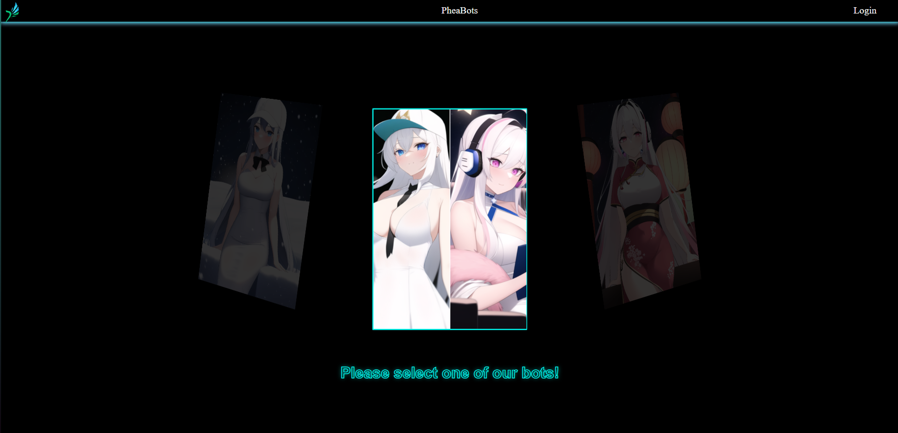

<h1 align="center"><strong><i>pheabots.fr by Phearion</i></strong></h1>

---

---

## Description

pheabots is the official website to invite one of our 2 bots:

* A-Nia
* Zilya

> Zilya is a multipurpose bots with a lot of features and a lot of commands.
It is for the moment in beta version and is not available for everyone.

> A-Nia aka the archive is the first ever bot made to help students.
Through its large archive of courses, it can help you to find the course you need.

## Credits

* Phearion TEAM

* ApoCs TEAM

